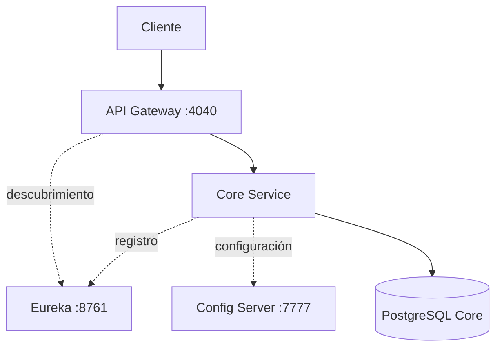

# Vaku 💉

Vaku es una plataforma orientada a mejorar la gestión y el seguimiento de la vacunación infantil. Este repositorio contiene la evolución del backend hacia una arquitectura de microservicios basada en Spring Boot y Spring Cloud.


> **Estado:** desarrollo activo. La infraestructura base y el servicio `core-server` están implementados; los demás dominios continuarán incorporándose progresivamente.

## Objetivo

Centralizar información de vacunación, catálogos territoriales y centros de salud para facilitar procesos confiables, trazables y escalables. La arquitectura separa responsabilidades por dominio y permite incorporar nuevos servicios sin acoplarlos al núcleo existente.

## Arquitectura actual



| Componente | Responsabilidad | Estado |
| --- | --- | --- |
| `registry` | Registro y descubrimiento de servicios con Eureka. | Implementado |
| `config-server` | Configuración centralizada desde un repositorio Git. | Implementado |
| `gateway-server` | Punto de entrada y enrutamiento dinámico. | Implementado |
| `core-server` | Catálogos compartidos y reglas del dominio central. | En desarrollo |
| PostgreSQL | Bases separadas para core, autenticación, inventario, notificaciones, reportes y auditoría. | Infraestructura preparada |
| Redis | Caché disponible para los servicios que lo requieran. | Infraestructura preparada |

## Funcionalidades implementadas

- Consulta de países, departamentos y ciudades.
- Consulta de tipos de documento por país.
- Consulta de tipos de sangre.
- Consulta de centros de salud.
- Organización del dominio mediante arquitectura hexagonal:
  - puertos de entrada y salida;
  - servicios de aplicación;
  - adaptadores REST;
  - adaptadores de persistencia con Spring Data JPA.
- Descubrimiento de servicios con Eureka.
- Configuración centralizada con Spring Cloud Config.
- Enrutamiento mediante Spring Cloud Gateway.
- Documentación OpenAPI para el servicio central.

## Estructura del repositorio

```text
Backend/
├── config-server/    # Configuración centralizada
├── core-server/      # Catálogos y dominio compartido
├── gateway-server/   # Entrada y enrutamiento
├── registry/         # Eureka Server
├── DataBase/         # Scripts y datos iniciales
└── docker-compose.yml
```

## Tecnologías

- Java 25 y Gradle.
- Spring Boot, Spring Cloud Config, Eureka y Gateway.
- Spring Data JPA y PostgreSQL.
- Redis y Docker Compose.
- Springdoc OpenAPI.
- JUnit.

## Ejecución local

### Requisitos

- Java 25.
- Docker y Docker Compose.
- Git.
- Acceso a un repositorio compatible de configuración para Spring Cloud Config.

### 1. Clonar el proyecto

```bash
git clone https://github.com/NelsonZarazaDev/Vaku.git
cd Vaku/Backend
```

### 2. Levantar la infraestructura

```bash
docker compose up -d
```

Este comando inicia PostgreSQL para los diferentes dominios y una instancia de Redis.

### 3. Configurar el entorno

| Variable | Ejemplo local | Uso |
| --- | --- | --- |
| `EUREKA_URL` | `http://localhost:8761/eureka/` | Registro de servicios |
| `CONFIG_SERVER_HOST` | `http://localhost:7777` | Configuración de `core-server` |
| `GIT_TOKEN` | Token con acceso de lectura | Lectura del repositorio de configuración |

No publiques tokens ni contraseñas. Utiliza variables de entorno o un gestor de secretos.

### 4. Iniciar los servicios

Ejecuta cada servicio en una terminal independiente y en este orden:

```bash
cd registry
./gradlew bootRun
```

```bash
cd config-server
./gradlew bootRun
```

```bash
cd core-server
./gradlew bootRun
```

```bash
cd gateway-server
./gradlew bootRun
```

En Windows reemplaza `./gradlew` por `gradlew.bat`.

## Ecosistema Vaku

- [Frontend](https://github.com/NelsonZarazaDev/Vaku_Frontend)
- [Landing page](https://github.com/NelsonZarazaDev/LandingPage-Vaku)

## Próximos pasos

- Incorporar los servicios de autenticación, inventario, notificaciones, reportes y auditoría.
- Centralizar secretos fuera del repositorio.
- Ampliar pruebas unitarias y de integración.
- Añadir integración continua y observabilidad.
- Contenerizar los servicios de aplicación.

---

Proyecto desarrollado por [Nelson Mauricio Navarro Zaraza](https://github.com/NelsonZarazaDev).
